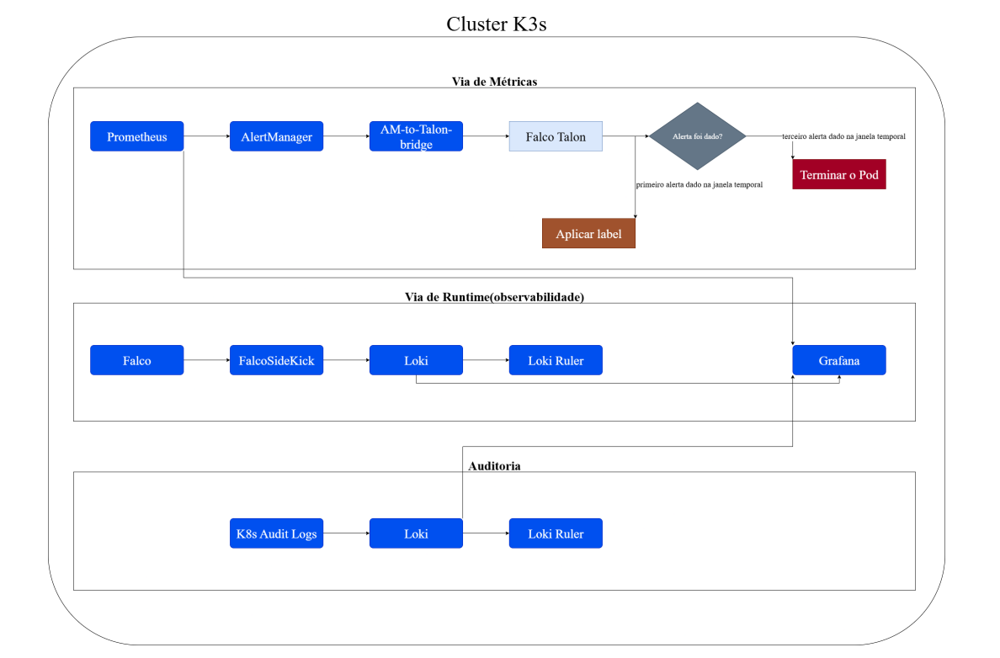

# Kubernetes PVC Security (K3s) — Falco, Loki, Prometheus, Talon

Detect, correlate, and respond to suspicious PVC I/O in Kubernetes.  
Runtime signals via Falco→Loki. Metrics alerts via Prometheus→Alertmanager. Actions via a small bridge → Falco Talon.

## Why
Cut MTTD/MTTR for PVC-related anomalies. Keep a clear audit trail end-to-end.

## Architecture
- **Runtime:** Falco + FalcoSidekick → Loki
- **Metrics/Alerts:** Prometheus + Alertmanager
- **Action:** `am-to-talon-bridge` translates Alertmanager JSON to Talon HTTP API
- **Audit:** API server audit logs to Loki (optional)


## Quick start (local demo with kind)
Prereqs: Docker, kind, kubectl, helm.
```bash
./scripts/demo-kind.sh
kubectl get pods -A
